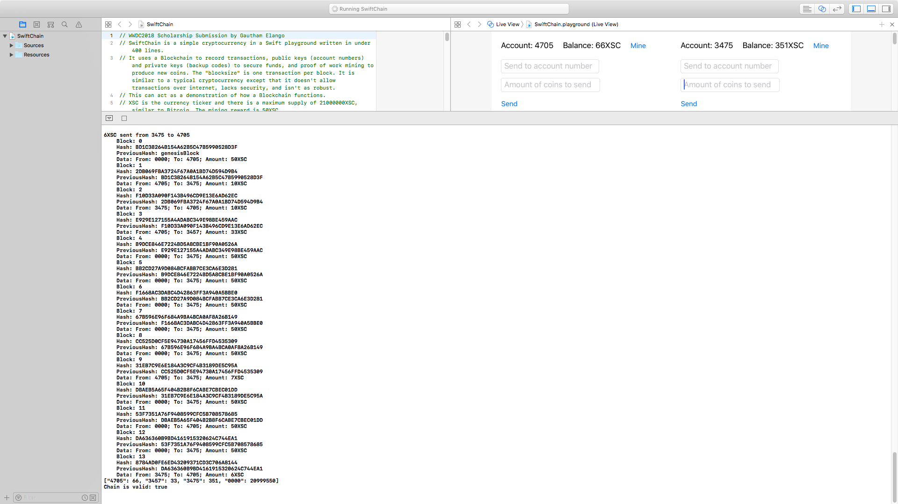

# SwiftChain

 

Simple Cryptocurrency in a Swift Playground.

SwiftChain uses a Blockchain to record transactions, public keys (account numbers) and private keys (backup codes) to secure funds, and proof of work mining to produce new coins. Everything is done within the playground and is not persistent so transactions can't be sent to another computer. This can act as a demonstration of a Blockchain. [Video](https://youtu.be/4i_TtI5YmCs).

